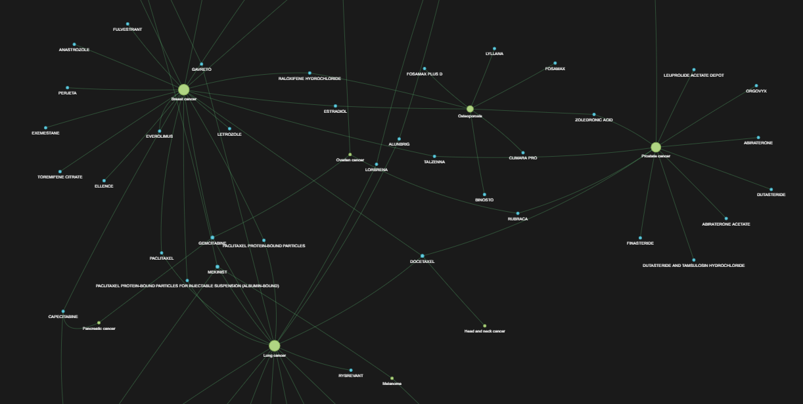

# medication-inference
This project is an effort to become familiar with graph networks and visualisations, with the focus area being 
pharmaceuticals and their usage. All data is either sourced from 
the [FDA drug database API](https://open.fda.gov/apis/drug/ndc/) or is proprietary (e.g. `diseases.json`is my own data).

This repo covers the following steps:
- Data sourcing and processing via FDA API via multiple endpoints
- Extraction of indications from drug labels using regex (soon to incorporate simple NLP steps)
- Creation of a graph with nodes for drugs and indications, 
with drug nodes tagged with various attributes (dose, route, generic, brand, etc.)
- Deployment of the graph to a html page with basic interactive features using [pyvis](https://pyvis.readthedocs.io/en/)

